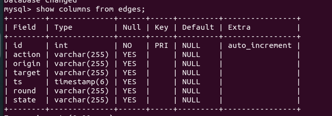

### This project is for CSI5308. The pBFT consensus implementation follows this [article](https://medium.com/coinmonks/implementing-pbft-in-blockchain-12368c6c9548) and [EIP](https://github.com/ethereum/EIPs/issues/650). Visualizationt tool can be found [here](https://github.com/bianyuanop/pbft-metrics).


(Image from aforementioned EIP)

Transaction module and block processing module are not implemented here since the aim of the project is to visualize the consensus. 

Each node contains two objects

1. p2p - which is backed by libp2p mdns and swarm
2. state - which is implemented for messages handling

since it's using mdns peer finding behavior, so it can be only used in LAN.

The swarm is responsible for peers finding and messages passing.

- When a peer subscribes the message channel, it will call `state.on_new_peer(peer_id)` to check if it's able to start(the count of nodes >= 2f+1).
- when a message is passed through the channel, it will call `state.on_message(msg, peer_id)` to process the message and change phase if applicable.

Both `on_new_peer` and `on_message` generate responses, when the responses are marked with `BROADCAST`, the messages in it will be broadcast to the whole network. The two functions fullfill the needs of normal phase transition.

For `RoundChange`, we need to set a ticker to check if the node needs to change round, the ticker will call `state.check_timeout()` every 200ms. 

#### Atomicity

For the state of one node, there is a `phase` attribute, every handler `on_message`, `on_new_peer`, `check_timeout`, `...` will check current phase to determine if it's able to go on. If it's not in right phase, the node will simply ignore the message. 

#### Configuration 

You need to configure the Mysql credentials at main.rs L71, then create a table in `pbft` database called `edges` as 



#### Start pBFT

The project is backed by rust, you need to install **rust** first and have **cargo** installed. After installation, type 

```
./scripts/start.sh <f>
```

for simple visualization, just set f to be 1.

If want to test `RoundChange` functionality, set f to be 2 and close the window of Node 0 (actually random one that with id<2f+1), you will find all the nodes will wait 5s when primary fails, and continue execution after `RoundChange` if the new node is not faulty. If the new node is faulty, they will continue `RoundChange` till find a good one. 

#### Screenshots 

